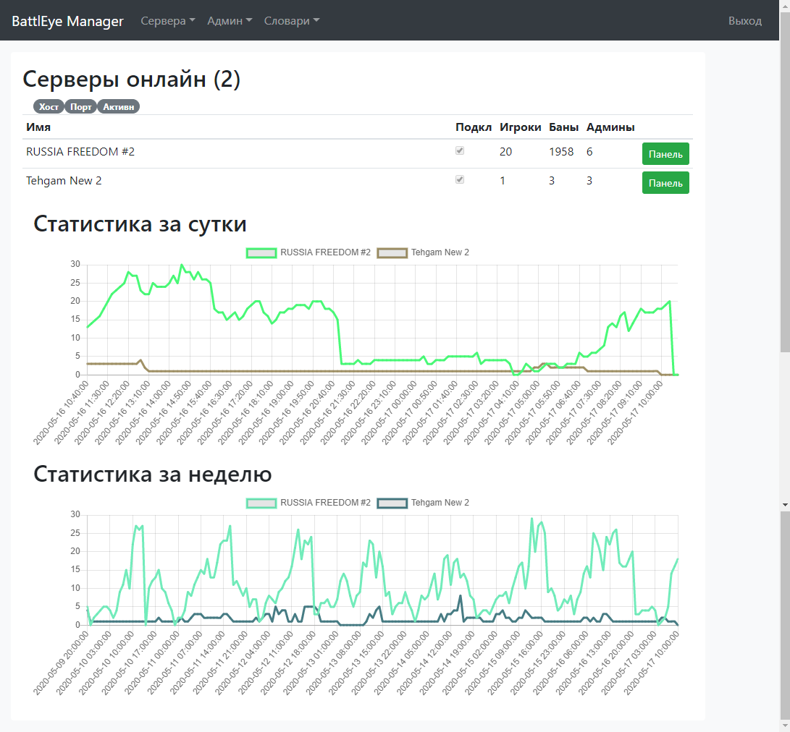
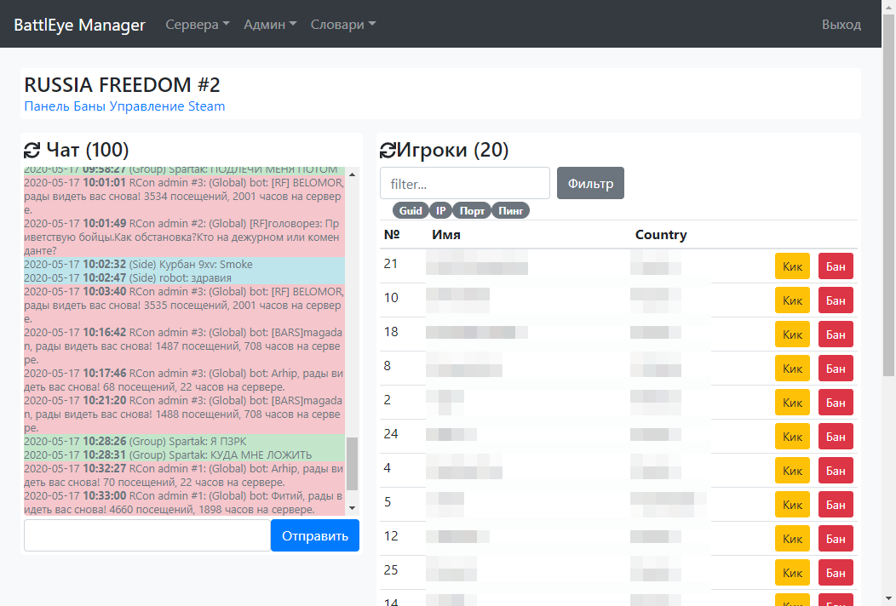
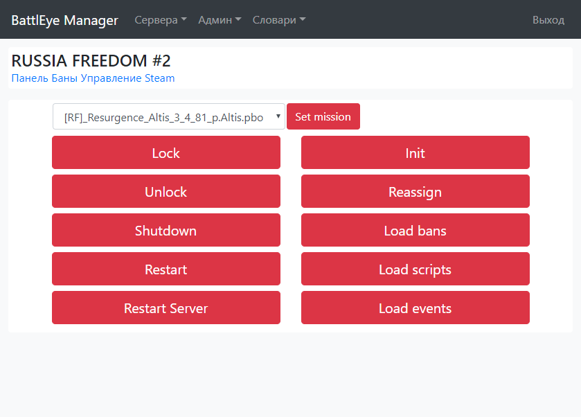
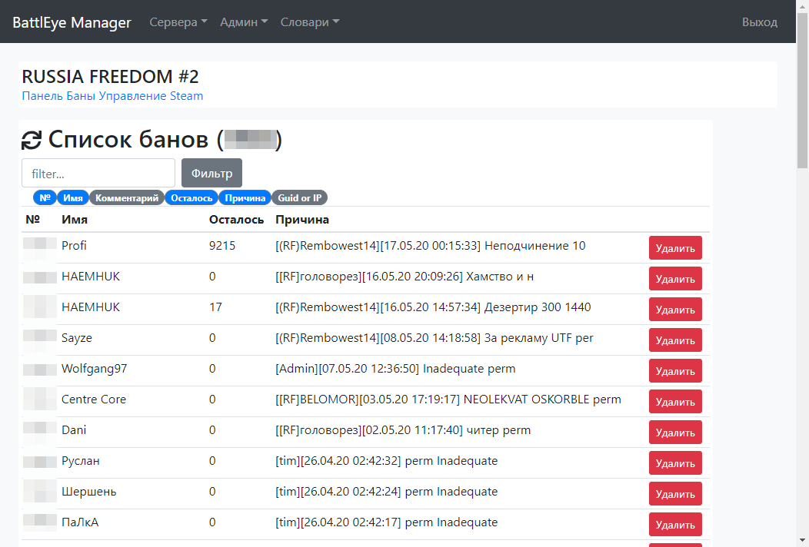
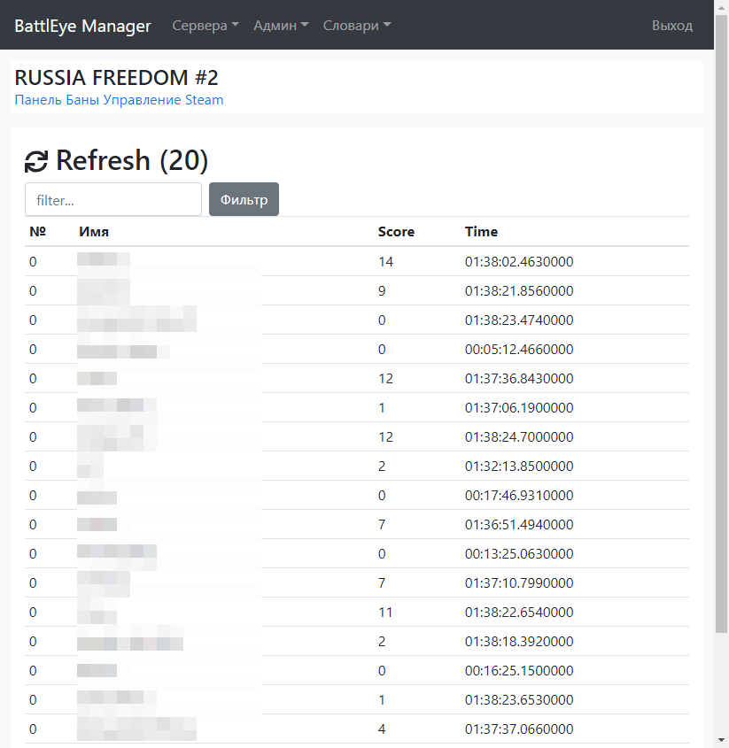

# README #

Main purpose of this software is to manage Arma3 game server via Battleye protocol. 

Its built on top of asp.net core 2.2 and MySQL database. 

## Features:

### Server dashboards

### Server main page

### Server managing

### Server Ban List

### Steam query support

